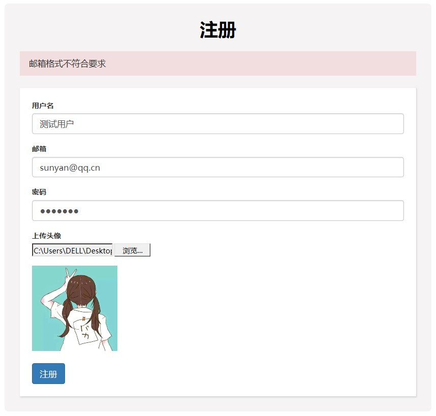
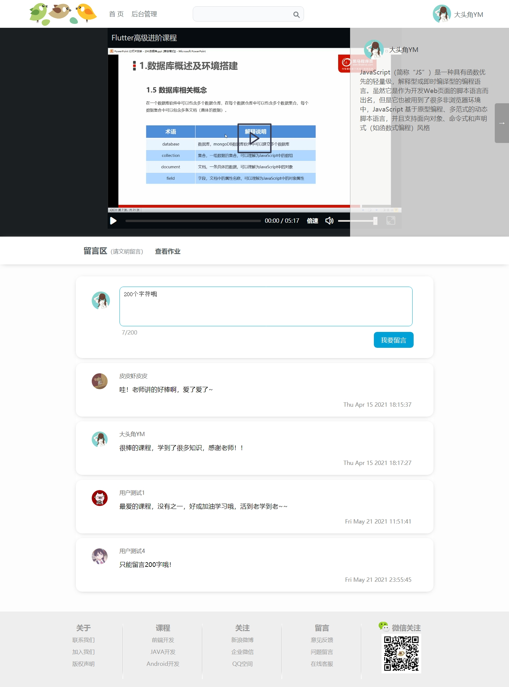
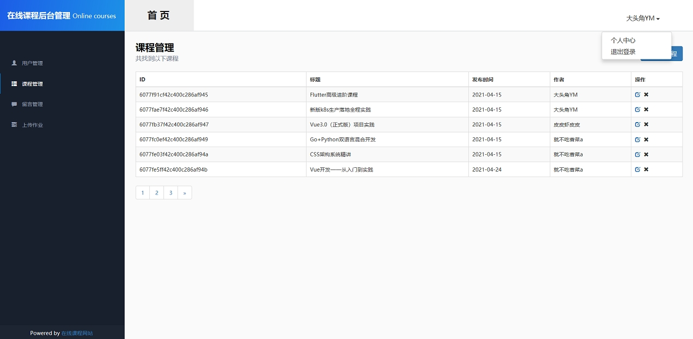
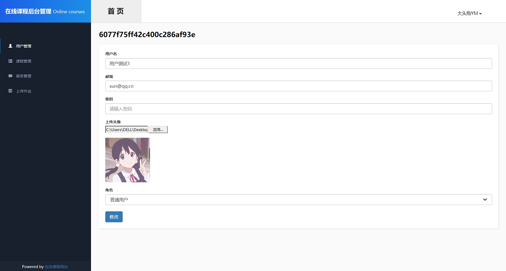
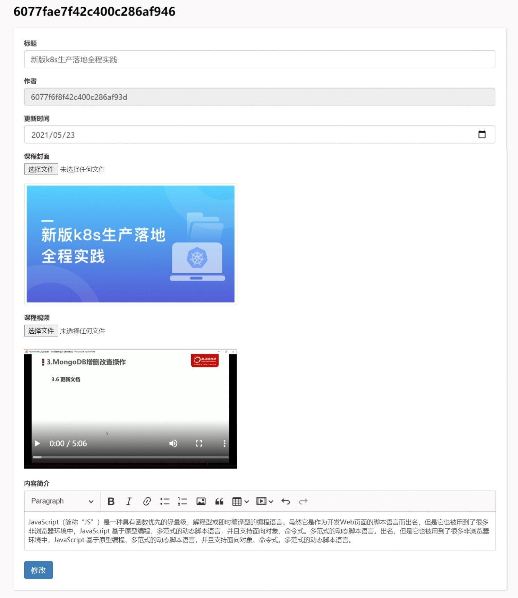
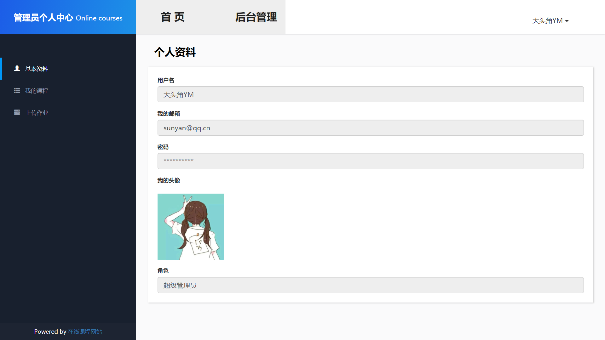
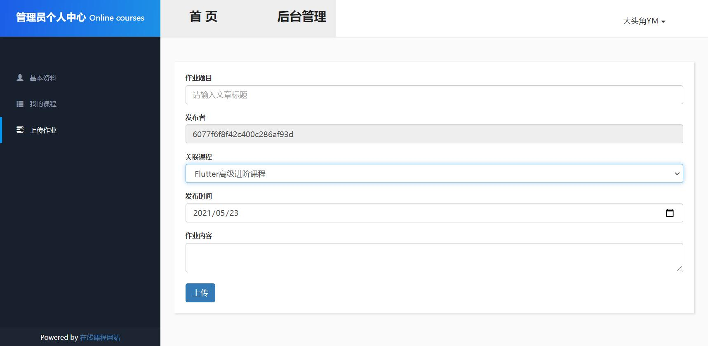

# Online-course-website

### 系统简介

这是使用Node.js+Express+MongoDB实现的一个在线课程网站。

- 数据库中所有用户的密码均为123456，进行过加密处理

## 系统已有功能介绍

#### 登录、注册、退出登录功能

1. 登录：使用邮箱和密码进行登录，并将用户登录信息保存在session中，存储时间为一天。
2. 注册：注册时会判断邮箱是否已存在，来确保邮箱的唯一性，注册用户的角色均为普通用户。
3. 退出登录：删除session中存储的用户登录信息。

### 管理员模块

管理员用户登录系统后会自动跳转到后台管理界面。

#### 用户管理

1. 新增用户功能 ：会判断填写的邮箱是否已存在来确保邮箱的唯一性，并且验证填写的信息是否合法，可选择用户角色（管理员或普通用户）。这个功能主要是为了新增管理员用户，普通用户可以通过注册来增加。
2. 编辑用户功能：需要填写密码，密码正确才可以修改用户信息，同样会判断填写信息是否合法。
3. 删除用户功能

#### 课程管理

1. 上传课程功能：作者默认为当前登录用户，日期默认为当前日期，会判断填写的课程信息是否合法。
2. 编辑课程功能：作者不可更改。
3. 删除课程功能

#### 留言管理

管理员可看到所有用户留言，可将不合法留言删除。

#### 上传作业

管理员只能看到所有作业，但是不可更改或删除。若想要管理作业可以进入个人中心去管理自己发布的作业。

#### 个人中心

1. 可查看个人资料
2. 可查看自己上传的课程信息并进行操作
3. 上传作业功能：发布者不可更改，关联课程可选择自己上传的课程，发布时间默认为当前日期。
4. 删除作业

### 普通用户模块

#### 首页展示

普通用户登录自动跳转到系统首页，进入后可看到一个课程轮播图，下方可查看到课程信息列表，点击进入具体课程进行学习。

#### 课程学习界面

进入课程学习界面可进行观看视频，可进行全屏及倍速播放，视频右方可看到上传者以及课程简介，下方为留言区及作业。

#### 留言功能

可在留言区查看到课程留言及留言用户，可在留言框内输入留言内容，限制200字符，点击留言展示在下方。

#### 搜索课程

首页及课程学习页上方有搜索框，可在框内输入课程关键字进行模糊查询。

#### 登录拦截

普通用户不被允许进入到后台，输入后台网址也会自动跳转到首页。

## 系统图片展示

1. 注册页面

   

2. 系统首页

   

3. 课程学习页

   

4. 信息展示界面（管理系统）

   

5. 用户修改界面

   

6. 课程编辑界面

   

7. 管理员个人中心

   

8. 作业管理

   